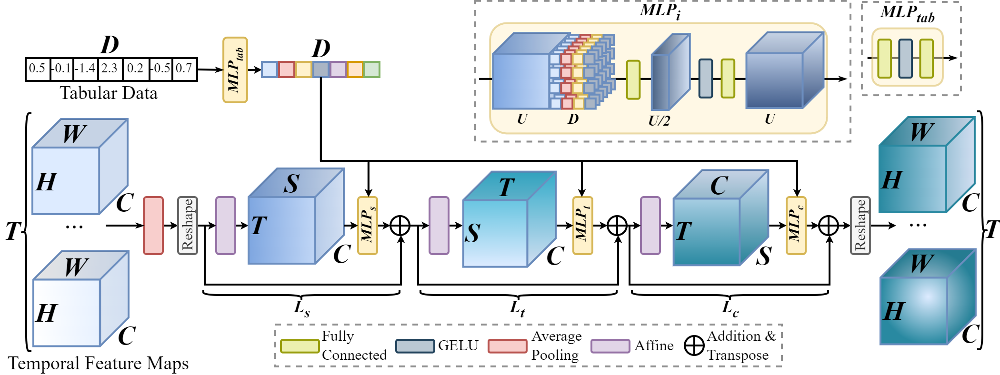

## TabMixer: Noninvasive Estimation of the Mean Pulmonary Artery Pressure via Imaging and Tabular Data Mixing

This is the official code for "TabMixer: Noninvasive Estimation of the Mean Pulmonary Artery Pressure via Imaging and
Tabular Data Mixing" presented at the 27th International Conference on Medical Image Computing and Computer Assisted
Intervention (MICCAI) 2024.



### Abstract

Right Heart Catheterization is a gold standard procedure for diagnosing Pulmonary Hypertension by measuring mean
Pulmonary Artery Pressure (mPAP). It is invasive, costly, time-consuming and carries risks. In this paper, for the first
time, we explore the estimation of mPAP directly from videos of noninvasive Cardiac Magnetic Resonance Imaging. To
enhance the predictive capabilities of Deep Learning models used for this task, we introduce an additional modality in
the form of demographic features and clinical measurements. Inspired by all-Multilayer Perceptron architectures, we
present TabMixer, a novel module enabling the integration of imaging and tabular data through spatial, temporal and
channel mixing. Specifically, we present the first approach that utilizes Multilayer Perceptrons to interchange tabular
information with imaging features in vision models. We test TabMixer for mPAP estimation and show that it enhances the
performance of Convolutional Neural Networks, 3D-MLP and Vision Transformers while being competitive with previous
modules for imaging and tabular data. Our approach has the potential to improve clinical processes involving both
modalities, particularly in noninvasive mPAP estimation, thus, significantly enhancing the quality of life for
individuals affected by Pulmonary Hypertension.

### Repository details

In this repository we provide the code for using TabMixer integrated with 3D CNNs, Transformers and all-MLP
architectures. We provide pretrained weights of
I3D [here](https://www.dropbox.com/scl/fi/4pf5g84a4s2h1wyi9430f/inception.pt?rlkey=ff85elk3yksm8a4hsy9icnwvc&dl=0) and
I3D+TabMixer [here](https://www.dropbox.com/scl/fi/yv8yrd616qqvufue2bv10/inception_tabmixer.pt?rlkey=5l3l398od40297x9oxnov0ypy&dl=0).


### TabMixer module

TabMixer can be seamlessly integrated within any 3D vision network with hierarchical structure as an intermediate layer. Basic usage:

```python
import torch
from src.tabmixer import TabMixer

x_input = torch.randn(1, 8, 16, 32, 32)  # B,C,F,H,W
tab_input = torch.randn(1, 6)  # 6 tabular features

module = TabMixer(channel_dim=8, frame_dim=16, hw_size=(32, 32), tab_dim=6)
module(x_input, tab_input)
```

The example of integrating TabMixer module with I3D network is presented in the _example.py_ file:

```python
import torch
from src.models.inceptioni3d import InceptionI3d
from src.tabular_data import get_tabular_config

conf = get_tabular_config(input_shape=(1, 1, 16, 128, 128), model_name="Inception", module="TabMixer", tab_dim=6)
x = torch.randn(1, 1, 16, 128, 128)
y = torch.randn(1, 6)
model = InceptionI3d(num_classes=1, in_channels=1, tabular_config=[conf[-1]])
print(model.forward(x, y).shape)
```

